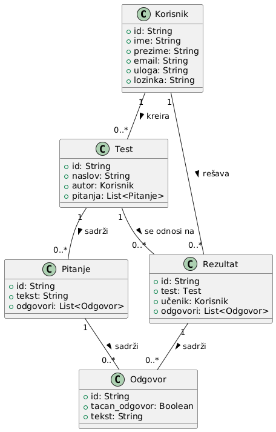

# Veb platforma za testiranje znanja zasnovana na teoriji prostora znanja

## Opis projekta

Cilj ovog projekta je izrada veb aplikacije koja omogućava nastavnicima kreiranje testova i sprovođenje online testiranja zasnovanog na teoriji prostora znanja. Aplikacija treba da pruži sledeće funkcionalnosti:

1. **Kreiranje testova** – Nastavnici mogu kreirati testove sa pitanjima tipa višestrukog izbora.
2. **Popunjavanje testova** – Učenici popunjavaju testove putem platforme.
3. **IMS QTI specifikacija** – Testovi su predstavljeni u skladu sa IMS QTI specifikacijom za prenos i razmenu podataka o testovima.
4. **Uslovljenost redosleda pitanja** – Redosled pitanja na testu zavisi od očekivanog prostora znanja koji definiše ekspert.
5. **Definisanje prostora znanja** – Ekspert definiše očekivani prostor znanja unutar platforme.
6. **Generisanje stvarnog prostora znanja** – Na osnovu rezultata testa formira se stanje znanja i stvarni prostor znanja.
7. **Vizualizacija** – Dobijeni prostor znanja vizuelizuje se u formi grafa.

## Tehnologije

Aplikacija će koristiti sledeće tehnologije:

- **Frontend**: React
- **Backend**: Python
- **Baza podataka**: PostgreSQL

## Komponente aplikacije

### 1. **Frontend (React)**
   - **Kreiranje testova**: Komponenta koja omogućava nastavnicima da kreiraju testove definisanjem pitanja i odgovora.
   - **Popunjavanje testova**: Komponenta koja omogućava učenicima da popunjavaju testove online.
   - **Vizualizacija prostora znanja**: Komponenta za prikaz stanja i stvarnog prostora znanja u formi grafa.
   - **Autentifikacija korisnika**: Komponenta za prijavu nastavnika, učenika i eksperta.

### 2. **Backend (Python)**
   - **API za upravljanje testovima**: Kreiranje, izmena i pregled testova putem REST API-ja.
   - **Vizualizacija podataka**: Generisanje podataka za prikaz grafa stvarnog prostora znanja.
   - **Autentifikacija i autorizacija**: Upravljanje korisničkim nalozima i pristupnim pravima.

### 3. **Baza podataka (PostgreSQL)**
   - **Korisnici**: Čuvanje podataka o nastavnicima, učenicima i ekspertima.
   - **Testovi**: Skladištenje kreiranih testova, pitanja i ponuđenih odgovora.
   - **Rezultati**: Čuvanje rezultata testiranja za svakog učenika.

## Model

## Članovi tima
- Marko Janošević - R2 16/2024
- Luka Đorđević - R2 18/2024
